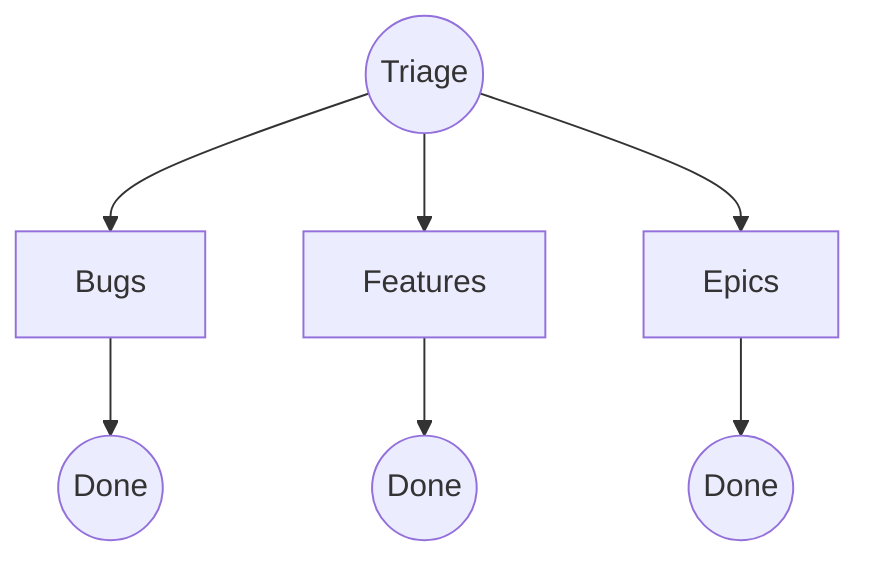

# 📌 OndaFactory – Come segnalare bug, feature ed epiche

Benvenuti in **OndaFactory**: questo è il punto di ingresso unico per tutte le segnalazioni.

Se hai un problema, un’idea o una proposta, **[apri una issue qui](https://github.com/ondafactory/triage/issues/new)**. Non importa che sia un bug, una feature, un miglioramento o un progetto strategico: ci pensiamo noi a instradarla nel flusso giusto.

---

## 🚨 Cosa segnalare qui

Quando apri una **issue** su questo repository, puoi segnalare:

- **🐞 Bug** → un problema tecnico che blocca o limita l’uso della piattaforma.
- **✨ Feature** → una nuova piccola funzionalità, un miglioramento, una modifica o ottimizzazione ad una funzionalità esistente.
- **🚀 Epic** → un progetto ampio e prioritario

👉 Tutto parte da **qui**, poi la issue viene valutata e spostata nel backlog corretto (bugs, features, epics).

---

## 📝 Come inserire una issue

1. Vai su **[New Issue](https://github.com/ondafactory/triage/issues/new)**.  
2. Scegli il **template** corretto in base al tipo di segnalazione:  
   - **Bug report**  
   - **Feature request / miglioramento**  
   - **Epic strategica**  
3. Compila i campi richiesti.  
4. Salva la issue: sarà il team di sviluppo a spostarla nel backlog giusto.

## 📦 Repository

| Repository                                                   | Contenuto                                                | Destinatari |
| ------------------------------------------------------------ | -------------------------------------------------------- | ----------- |
| [`triage`](https://github.com/ondafactory/triage/issues)     | Tutte le segnalazioni iniziali: bug, richieste, idee.    | Tutti       |
| [`bugs`](https://github.com/ondafactory/bugs/issues)         | Problemi tecnici da risolvere.                           | Dev         |
| [`features`](https://github.com/ondafactory/features/issues) | Piccole nuove funzionalità o miglioramenti (1–2 giorni). | Dev · PO    |
| [`epics`](https://github.com/ondafactory/epics/issues)       | Progetti strategici più grandi (settimane/mesi).         | Dev · PO    |

> Apri *sempre* in **triage** → poi sarà il team di sviluppo a spostare la issue nel backlog corretto (**bugs**, **features**, **epics**).
> *(Per favore **non** aprire direttamente ticket negli altri repo: l'accesso in scrittura è limitato).*

---

## 🔄 Flusso

---

  Realizzato con ☕🍪🍵 dal team Onda

