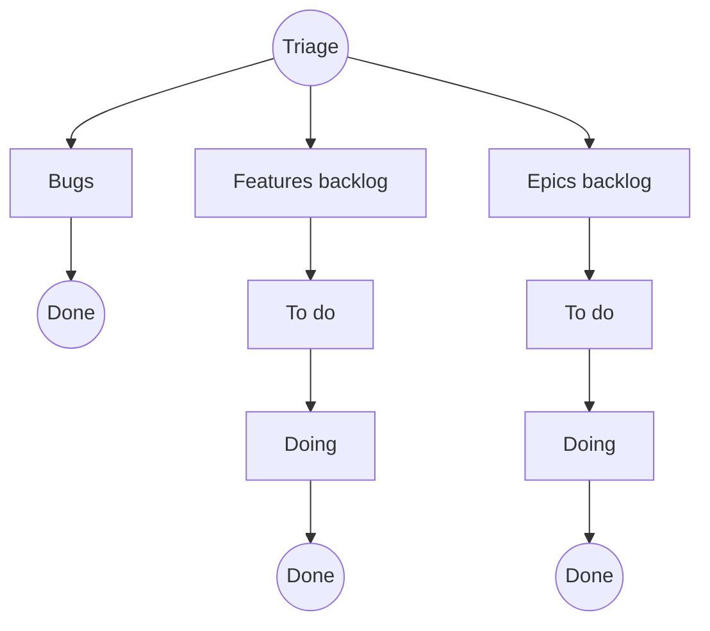

# 📌 Come segnalare bug, feature ed epiche

**OndaFactory** è il punto di raccolta unico per tutte le segnalazioni.

Se hai un problema, un’idea o una richiesta, **[apri una issue qui](https://github.com/ondafactory/triage/issues/new)**.  
Può essere un bug, una nuova funzionalità, un miglioramento o un progetto strategico.

---

## 🚨 Cosa segnalare

Quando apri una **issue** su questo repository, puoi scegliere tra:

- **🐞 Bug** → un problema che blocca o limita l’uso della piattaforma.  
- **✨ Feature** → una nuova funzionalità o un miglioramento a qualcosa di esistente.  
- **🚀 Epic** → un progetto ampio.  

---

## 📝 Come inserire una issue

1. Vai su **[New Issue](https://github.com/ondafactory/triage/issues/new)**.  
2. Scegli la tipologia di issue: Bug, Feature o Epic.
3. Compila i campi richiesti.  
4. Salva la issue.  

👉 Sarà il team di sviluppo a spostarla nel backlog corretto.

---

## 📦 Repository

| Repository                                                   | Contenuto                                                | Destinatari |
| ------------------------------------------------------------ | -------------------------------------------------------- | ----------- |
| [`triage`](https://github.com/ondafactory/triage/issues)     | Tutte le segnalazioni iniziali.                          | Tutti       |
| [`bugs`](https://github.com/ondafactory/bugs/issues)         | Problemi tecnici da risolvere.                           | Dev         |
| [`features`](https://github.com/ondafactory/features/issues) | Piccole funzionalità o miglioramenti.                    | Dev · PO    |
| [`epics`](https://github.com/ondafactory/epics/issues)       | Progetti strategici.                                     | Dev · PO    |

> Apri *sempre* le segnalazioni in **triage** → il team le instraderà poi nel backlog corretto.  
> *(Gli altri repo hanno l’accesso in scrittura limitato).*

---

## 🔄 Flusso

---

  Realizzato con ☕🍪🍵 dal team Onda

