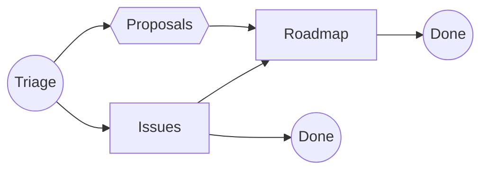

# Onda Factory

> Segnala problemi, proponi idee e contribuisci allo sviluppo di Onda — che tu sia Redattore, Designer o Sviluppatore, inizia da qui.

---

## 📝 Come segnalare un problema

1. Aggiungi una issue in **[`triage`](https://github.com/ondafactory/triage/issues/new)**.
2. Scegli un titolo e compila una descrizione chiara del problema.
3. Invia: ci penseremo noi.

---

## 📦 Repository

| Repository | Contenuto | Destinatari |
|------------|-----------|-------------|
| [`triage`](https://github.com/ondafactory/triage/issues) | Bug, idee o domande in forma grezza. **Nessun filtro**. | Tutti |
| [`proposals`](https://github.com/ondafactory/proposals/issues) | Idee e proposte da discutere e validare. | Tutti |
| [`issues`](https://github.com/ondafactory/issues/issues) | Task a breve termine: bug‑fix, piccoli miglioramenti, hot‑patch. | Dev |
| [`roadmap`](https://github.com/ondafactory/roadmap/issues) | Funzionalità più importanti che richiedono più tempo. | PM · Dev |

> Apri *sempre* in **triage** → poi saremo noi a spostare la issue in **proposals**, **issues** o **roadmap** a seconda dei casi.
> *(Per favore **non** aprire direttamente ticket negli altri repo: l'accesso in scrittura è limitato).*

---

## 🔄 Flusso

---

  Realizzato con ☕🍪🍵 dal team Onda Factory

